# 🩺 Diabetic Retinopathy Classifier (ViT + ResNet)


This project trains and deploys deep learning models (ViT & ResNet-50) for APTOS Diabetic Retinopathy classification.  
The diagram below shows the full pipeline:

```mermaid
flowchart TB
    %% --- Style Definitions ---
    classDef dataStyle fill:#E3F2FD,stroke:#333,stroke-width:2px,color:#0D47A1
    classDef vitStyle fill:#E8F5E9,stroke:#333,stroke-width:2px,color:#1B5E20
    classDef resnetStyle fill:#F3E5F5,stroke:#333,stroke-width:2px,color:#4A148C
    classDef evalStyle fill:#FFF3E0,stroke:#333,stroke-width:2px,color:#E65100
    classDef deployStyle fill:#E0F7FA,stroke:#333,stroke-width:2px,color:#006064

    %% --- Main Flow ---
    B["📄 Load Data"] --> C["🔍 Audit Images"]
    C --> D["✨ Preprocess Fundus<br/>(Crop + CLAHE + Resize)"]
    D --> E["⚖️ Stratified Split 80/20"]
    E --> F["🎚️ Calculate Class Weights"]
    
    B:::dataStyle
    C:::dataStyle
    D:::dataStyle
    E:::dataStyle
    F:::dataStyle

    %% --- Training Subgraphs ---
    subgraph ViT Training Pipeline
        direction TB
        G1["ViT AutoImageProcessor"] --> G2["PyTorch Dataset<br/>w/ Augmentations"]
        G2 --> G3["Phase 1: Train Head"]
        G3 --> G4["Phase 2: Fine-Tune<br/>(Unfreeze last 6 blocks)"]
        G4 --> G5["📦 Export Final Model"]
    end
    
    subgraph ResNet-50 Training Pipeline
        direction TB
        H1["TensorFlow tf.data Pipeline"] --> H2["ResNet50 + Dense(5)"]
        H2 --> H3["Fine-Tune Full Base"]
        H3 --> H4["💾 Save .keras Model"]
    end

    classDef vitSubgraph fill:#C8E6C9, color:#1B5E20
    classDef resnetSubgraph fill:#E1BEE7, color:#4A148C
    class G1,G2,G3,G4,G5 vitStyle
    class H1,H2,H3,H4 resnetStyle

    %% --- Evaluation & Deployment ---
    subgraph Evaluation & Metrics
        direction TB
        I1["📈 Track Metrics<br/>(Accuracy, QWK, F1)"]
        I2["✅ Select Best Checkpoint"]
        I3["🧪 Final Inference on Test Set"]
    end
    
    subgraph Deployment on Hugging Face Spaces
        direction TB
        K1["Load ViT & ResNet Models"] --> K2["User Uploads Image"]
        K2 --> K3["Conditional Preprocessing"]
        K3 --> K4["Predict & Show Results"]
    end

    class I1,I2,I3 evalStyle
    class K1,K2,K3,K4 deployStyle

    %% --- Connections ---
    F --> G1 & H1
    G5 --> I1
    H4 --> I3
    I2 --> K1
```



This project provides a web-based Gradio app to classify **Diabetic Retinopathy** severity using:
- **Vision Transformer (ViT, PyTorch)**  
- **ResNet-50 (TensorFlow/Keras)**  

The app lets you upload a fundus retinal scan and get predictions for 5 DR stages:
**No_DR, Mild, Moderate, Severe, Proliferative_DR**  
Outputs are mapped to the **APTOS clinical order** for consistency.

---

## 🚀 Demo

👉 Try the live app here:  
🔗 [Hugging Face Space](https://huggingface.co/spaces/Yeshwanth2410/DiabeticRetinopath-ViT-Resnet)

---

## 📂 Repository Structure

├── app.py                   # Gradio app: loads ViT + ResNet models
├── requirements.txt         # Dependencies
├── LICENSE                  # MIT License
└── README.md                # This file


⚠️ Note: The model weights (`.keras`, `.safetensors`) are **not stored in GitHub** because of file size limits.  
They are hosted on Hugging Face Hub instead (see below).

---

## 📦 Models

- **ViT model (final export)**:  
  Available inside the [Hugging Face Space files](https://huggingface.co/spaces/Yeshwanth2410/DiabeticRetinopath-ViT-Resnet/tree/main/dr-vit-EXPORT-final)  
  Includes:
  - `config.json`  
  - `model.safetensors`  
  - `preprocessor_config.json`  
  - `classes.json`

- **ResNet-50 model** (`retinopathy_baseline_model.keras`):  
  Also too large for GitHub. You can upload to Hugging Face Hub or provide a Google Drive link.

---

## 🔧 Installation & Local Run

Clone this repo:
```bash
git clone https://github.com/Yeshwanth-git-tech/DiabeticRetinopathy-ViT-Resnet.git
cd DiabeticRetinopathy-ViT-Resnet


## Install dependencies:

pip install -r requirements.txt

Training Notes
	•	ViT was fine-tuned in 2 phases (head-only + backbone unfreeze) with class-balanced loss.
	•	ResNet-50 was trained in Keras with a similar label remapping to match APTOS dataset order.
	•	Both models output predictions remapped into canonical order:
No_DR → Mild → Moderate → Severe → Proliferative_DR.

📜 License

This repo is licensed under the MIT License.
You are free to use, modify, and distribute it, but attribution is appreciated.


✨ Acknowledgements
	•	APTOS 2019 Blindness Detection Dataset
	•	Hugging Face Transformers
	•	Gradio